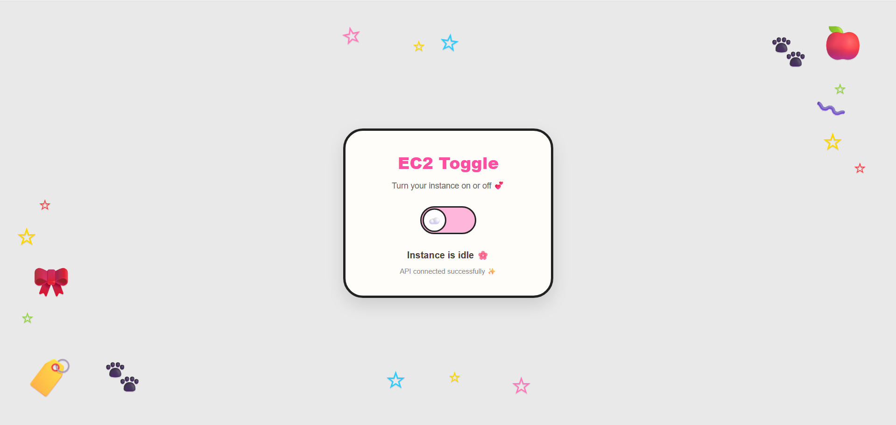

# EC2 Toggle

A cute and simple web app to **start or stop your AWS EC2 instance** with a single toggle switch — no console needed!



---

## Features

- One-click toggle to start or stop your EC2 instance
- Real-time status feedback
- Calls your AWS Lambda via API Gateway
- Fully static — no backend, no framework, just one HTML file

---

## How to Use

1. Open `index.html` in your browser, **or** visit the live GitHub Pages link
2. Flip the toggle to **start** or **stop** your instance
3. Wait for the status message to confirm the action

---

## Setup

### Prerequisites
- An AWS EC2 instance
- A Lambda function that handles `start` / `stop` actions
- An API Gateway endpoint connected to that Lambda

### Configuration

In `index.html`, find this line and replace with your own API Gateway URL:

```javascript
const endpoint = "https://your-api-id.execute-api.your-region.amazonaws.com/default/YourFunctionName";
```

---

## Security Notes

- Your API endpoint URL is visible in the source code since this is a static frontend
- **Recommended:** Restrict access in AWS API Gateway by setting CORS `Allow-Origin` to only your GitHub Pages domain:
  ```
  https://yourusername.github.io
  ```
- For stronger protection, consider adding an **API Gateway API Key**

---

## Project Structure

```
ec2-toggle/
├── index.html      # Main app (all-in-one HTML, CSS, JS)
└── README.md       # You're reading this!
```

---

## Built With

- Plain HTML, CSS, JavaScript
- AWS Lambda + API Gateway

---

## Preview

> Add a screenshot of your app here by uploading a `preview.png` to the repo!

---

*A Personal AWS management tool*